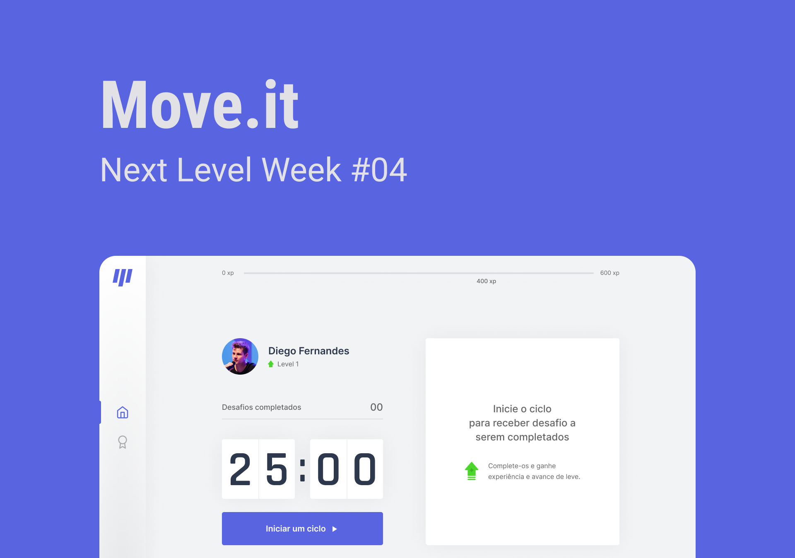

        
    <h1>Move.it</h1>  
    
💪 An application to exercise and stretch the body
    
    
    
    

        
        
        
        
        
    
     
    

        
    

# About

Have you ever stopped to think how long you stay on your computer screen without doing any kind of exercise? The moveit will help you in this regard, you can determine a certain time to do a physical exercise for your beautiful body.

 

# Techs

 - [Next.js](https://nextjs.org/) 
 - [TypeScript](https://www.typescriptlang.org/)

# Requirements

- [Git](https://git-scm.com/) installed
- [Node](https://node.js.org/) installed
- Npm or [Yarn](https://yarnpkg.com/) installed

# Usage

- Run `npm install` or `yarn install`.
- Run `yarn dev` and access `http://localhost:3000`

# Authors

<h2 id="author"> 💻 Author </h2>

 
 
 
 

  <h1>Open Source</h1>
  Copyright © 2021-present, brunnosena.
  
Move.it <a href="https://github.com/brunnosena/discord-clone/tree/dev/LICENSE">is MIT licensed 💖</a>

  

